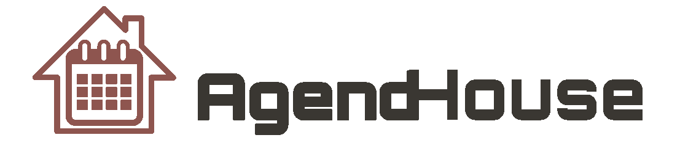

<h1 align="center">API 4º SEMESTRE - 2021-2</h1>

<p align="center">  </p>

<h2 align="center">
AgendHouse
</h2>

<h4 align="center">
Link para o repositório do projeto
</h4>

[Link para o projeto](https://github.com/TairikJohnny/API-4-SEMESTRE)

<h3 align="center">
Resumo
</h3>

Projeto realizado em parceria com a [Oracle Corporation](https://www.oracle.com/br/) uma empresa multinacional de tecnologia e informática norte-americana, especializada no desenvolvimento e comercialização de hardware e softwares e de banco de dados juntamente com a Faculdade de Tecnologia de São José dos Campos Professor Jessen Vidal. O projeto a ser desenvolvido vai ser um sistema para agendamentos de eventos na [Casa Oracle](https://blogs.oracle.com/oracle-brasil/casa-oracle-abre-as-portas-para-a-inovacao-em-sao-paulo) buscando solucionar os obstáculos da pandemia do [Covid-19](https://covid.saude.gov.br/). Desafio proposto pela Oracle Corporation - "No escritório de São Paulo, temos um espaço de inovação aberta chamado Casa Oracle, que é um local para realização de eventos internos/externos, workshops e palestras. Dentro do contexto das restrições sanitárias, nosso desafio é criar uma plataforma para o gerenciamento da utilização do espaço, onde nossos colaboradores poderão fazer a solicitação de agendamento, definindo os convidados e recursos necessários para o evento". Este projeto foi um grande desafio devido a falta de colaboração dos membros da equipe e como consequência trabalhei no front-end praticamente sozinho desenvolvendo todas as telas e features, porém, com muito foco e determinação eu consegui superar todas as adversidades e entregar o projeto funcionando de ponta a ponta.

<h3 align="center">Tecnologias adotadas na solução</h3>

<div align="center">

<a href="https://vuejs.org/">
  
</a>
<a href="https://www.javascript.com/">
  
</a>
<a href="https://www.npmjs.com/">
  
</a>
<a href="https://www.java.com/pt-BR/">
  
</a>
<a href="https://spring.io/projects/spring-boot">
  
</a>
<a href="https://maven.apache.org/">
  
</a>
<a href="https://www.oracle.com/br/cloud/">
  
</a>
<a href="https://www.atlassian.com/software/jira">
  
</a>
<a href="https://git-scm.com/">
  
</a>
<a href="https://github.com">
  
</a>

</div>

<h3 align="center">Contribuições individuais/pessoais</h3>

Nesse projeto eu assumi o papel de Scrum Master e atuei efetivamente no front-end desenvolvendo cerca de 95% do mesmo. Propus de utilizarmos o framework JavaScript Vue.js e ajudei os integrantes que não conheciam o framework. Fiz todo o gerenciamento do GitHub, como acessos aos repositórios e gerenciamento de branchs. Exercendo o papel de Scrum Master eu ajudei a gerenciar a equipe e o projeto, marcando as reuniões e seguindo os rituais da metodologia SCRUM. Segue abaixo algumas telas e métodos do sistema desenvolvidos por mim.

<details>
<summary><b>Tela de gerenciamento de Usuário (CRUD)</b></summary>

<p align="center">  </p>
<p align="center">  </p>

```bash
// Método de cadastro de usuario
cadastrar_usuario() {
  // Se o usuario não tiver um "cod" significa que esse usuario não existe então ele vai pra request de cadastro
  if (!this.usuario.cod) {
    Usuario.salvar_usuario(this.usuario)
      .then((resposta_cadastro_usuario) => {
        this.usuario = {};
        Swal.fire(
          "Sucesso",
          "Usuário " +
            resposta_cadastro_usuario.data.nome +
            " cadastrado com sucesso!!!",
          "success"
        );
        // Chama o método de exibir os usuarios na tela
        this.exibir_usuario();
      })
      .catch((e) => {
        Swal.fire(
          "Oops...",
          "Erro ao cadastrar o usuário! - Erro: " + e.response.data.error,
          "error"
        );
      });
    this.close();
  } else {
    // Método de atualizar usuario
    // Se o usuario já tiver um "cod" ele já existe então ele vai pra request de atualizar
    Usuario.atualizar_usuario(this.usuario)
      .then((resposta_atualizar_usuario) => {
        this.usuario = {};
        Swal.fire(
          "Sucesso",
          "Usuário " +
            resposta_atualizar_usuario.data.nome +
            " atualizado com sucesso!!!",
          "success"
        );
        // Chama o método de exibir os usuarios na tela
        this.exibir_usuario();
      })
      .catch((e) => {
        Swal.fire(
          "Oops...",
          "Erro ao atualizar o usuário! - Erro: " + e.response.data.error,
          "error"
        );
      });
    this.close();
  }
},
```

</details>

<details>
<summary><b>Tela de Agendamento de Evento</b></summary>

<p align="center">  </p>

```bash
// Método pra exibir os eventos
exibir_evento() {
  Evento.listar_eventos()
    .then((resposta_lista_evento) => {
      this.lista_de_eventos = resposta_lista_evento.data;
    })
    .catch((e) => {
      Swal.fire(
        "Oops...",
        "Erro ao carregar a tabela de eventos! - Erro: " +
          e.response.data.error,
        "error"
      );
    });
},
```

</details>

<details>
<summary><b>Tela de Visitante (CRUD)</b></summary>

<p align="center">  </p>
<p align="center">  </p>

```bash
// Método pra excluir os visitantes
deletar_visitante(visitante) {
  Visitante.excluir_visitante(visitante)
    .then((resposta_excluir_visitante) => {
      Swal.fire("Sucesso", "Visitante excluido com sucesso!!!", "success");
      resposta_excluir_visitante;
      this.exibir_visitante();
    })
    .catch((e) => {
      Swal.fire(
        "Oops...",
        "Erro ao excluir o visitante! - Erro: " + e.response.data.error,
        "error"
      );
    });
  this.closeDelete();
},
```

</details>

<h4 align="center">Hard Skills Efetivamente Desenvolvidas</h4>

- [x] <b>Vue.js</b>
    - Aprofundei os meus conhecimentos em Vue.js e no consumo de APIs.
    - Desenvolvi quase que por completo o Front-end utilizando o framework JavaScript.
    - Aprofundei os meus conhecimentos em HTML e CSS para desenvolver as telas da aplicação.
    - Sei fazer com autonomia.

- [x] <b>GIT e GitHub</b>
    - Aprofundei o meus conhecimentos no gerencimento de Organizações, Branchs e Repositórios no GitHub.
    - Sei fazer com autonomia.

- [x] <b>SCRUM</b>
    - Aprendi como é gerenciar uma equipe e um projeto através do método SCRUM.
    - Sei fazer com autonomia.

- [x] <b>Padrões de Projetos</b>
    - Aprofundei os meus conhecimentos na padrão de projetos MVC, o seu princípio básico é a divisão da aplicação em três camadas: a camada de interação do usuário (view), a camada de manipulação dos dados (model) e a camada de controle (controller).
    - Como utilizamos um framework Javascript para facilitar a programação eu aprofundei os meus conhecimentos no padrão de projetos Facade que é um padrão de projeto estrutural que fornece uma interface simplificada para uma biblioteca, um framework, ou qualquer conjunto complexo de classes.
    - Como utilizamos o framework Javascript Vue.js aonde temos a estrutura de componentes compondo componentes eu aprofundei os meus conhecimentos no padrão de projetos Composite que é um padrão de projeto estrutural que permite que você componha objetos em estruturas de árvores e então trabalhe com essas estruturas como se elas fossem objetos individuais.
    - Sei fazer com autonomia

<h4 align="center">Soft Skills Efetivamente Desenvolvidas</h4>

- [x] <b>Reponsabilidade</b>
    - Senti na pele a responsabilidade do cargo de Scrum Master no gerenciamento do projeto.
    - Sei fazer com autonomia.

- [x] <b>Relacionamento</b>
    - Devido o cargo de Scrum Master precisei manter um relacionamento harmonioso com todos os membros do grupo.
    - Sei fazer com autonomia.

- [x] <b>Trabalho em Equipe</b>
    - Precisei manter todos os membros do grupo entrosados para o bom andamento do projeto.
    - Sei fazer com autonomia.

- [x] <b>Comunicação</b>
    - A comunicação foi essencial para lidar com a equipe durante o projeto.
    - Sei fazer com autonomia.