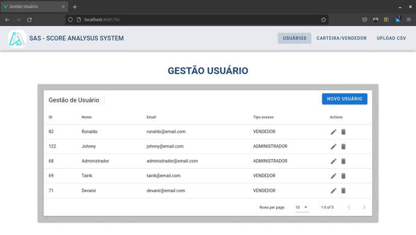
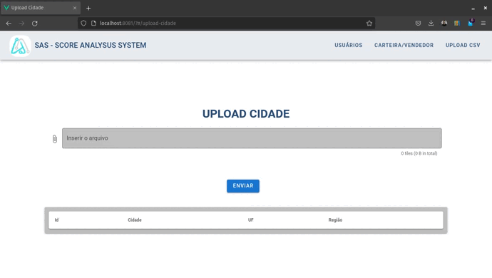
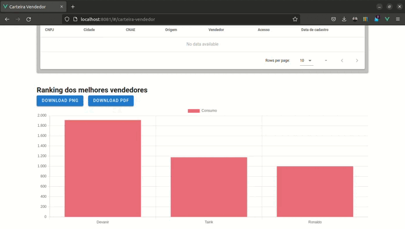
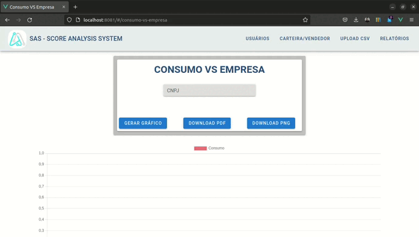

<h1 align="center">API 5º SEMESTRE - 2022-1</h1>

  

<h2 align="center">
SAS - Score Analysis System
</h2>

<h4 align="center">
Link para o repositório do projeto
</h4>

[Link para o projeto](https://github.com/TairikJohnny/API-5-SEMESTRE-DOCUMENTACAO)

<h3 align="center">
Resumo
</h3>

Projeto realizado em parceria com o [SPC](https://www.spcbrasil.org.br/) que é uma organização de gestão e inteligência de dados que entrega soluções de crédito, cobrança, antifraude, marketing e certificação digital juntamente com a Faculdade de Tecnologia de São José dos Campos Professor Jessen Vidal. O projeto a ser desenvolvido vai ser um sistema para buscar novas receitas através da criação de novas segmentações de clientes para a empresa parceira. Desafio proposto pela SPC - "Temos um novo desafio na área de vendas que é buscar novas receitas através da criação de novas segmentações de clientes. Para isso precisaremos da criação de novos modelos de dados e indicadores que suportarão as estratégias de vendas (contato com clientes e prospects observando as suas particularidades relacionadas a segmentos, verticais de atuação, consumo e potencial de consumo)."

<h3 align="center">Tecnologias adotadas na solução</h3>

  

  
  
  

  
  

<h3 align="center">Contribuições individuais/pessoais</h3>

Nesse projeto eu atuei como Scrum Master e atuei efetivamente no front-end desenvolvendo as principais telas do sistema. Ajudei na implementação das demandas de Devops e no deploy da aplicação na Heroku. Ajudei no desenvolvimento da documentação do projeto. Segue abaixo algumas telas do sistema desenvolvidos por mim.

Demonstração da tela de Gestão de Usuários(CRUD)

Demonstração da tela de Gestão da Carteira/Vendedor

Demonstração das telas de upload de CSV

Demonstração do gráfico de ranking dos vendedores

Demonstração da tela de Consumo VS Empresa

Demonstração da tela de Score

<h4 align="center">Hard Skills Efetivamente Desenvolvidas</h4>

- [x] <b>Vue.js</b>
    - Dominei o Vue.js e o consumo de APIs.
    - Desenvolvi 90% do Front-end utilizando o framework JavaScript.
    - Aprofundei os meus conhecimentos em HTML e CSS para desenvolver as telas da aplicação.
    - Aprendi a criar gráficos no Vue.js.
    - Ensinei os membros do grupo que não sabiam utilizar o framework.
    - Sei ensinar.

- [x] <b>SCRUM</b>
    - Aprofundei os meus conhecimento do método SCRUM.
    - Melhorei o meu gerenciamento da equipe e do projeto.
    - Aprendi a dividir melhor as tasks dentro das sprints.
    - Sei fazer com autonomia.

- [x] <b>DevOps</b>
    - Aprendi a implementar processos de Devops no projeto.
    - Aprendi a implementar processos de Devops pelo Github.
    - Aprendi a fazer deploy de aplicações na Heroku.
    - Sei fazer com autonomia.

<h4 align="center">Soft Skills Efetivamente Desenvolvidas</h4>

- [x] <b>Empatia</b>
    - Precisei ter empatia com os membros do grupo que não sabiam trabalhar com o Vue.js
    - Sei fazer com autonomia.

- [x] <b>Foco</b>
    - Precisei ter foco para conseguimos entregar o MVP durante as sprints.
    - Sei fazer com autonomia.

- [x] <b>Reponsabilidade</b>
    - Novamente assumindo o cargo de Scrum Master precisei ser responsável com o grupo e fazer a minha parte.
    - Sei fazer com autonomia.

- [x] <b>Trabalho em Equipe</b>
    - Precisei manter todos os membros do grupo entrosados para o bom andamento do projeto.
    - Sei fazer com autonomia.

- [x] <b>Comunicação</b>
    - A comunicação foi essencial para lidar com a equipe durante o projeto mesmo durante conflitos de ideias.
    - Sei fazer com autonomia.
