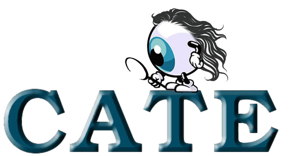

<h1 align="center">API 6º SEMESTRE - 2022-2</h1>

  

<h2 align="center">
CATE - Coleta Análise Tratamento Exibição
</h2>

<h4 align="center">
Link para o repositório do projeto
</h4>

[Link para o projeto](https://github.com/API-6-SEMESTRE/Documentacao)

<h3 align="center">
Resumo
</h3>

O projeto realizado em parceria com a [Dom Rock](https://www.domrock.net/) que é uma empresa do ramo de tecnologia de dados que amplia ganhos em marketing, vendas, distribuição, logística, operações, engenharia e finanças, possui uma plataforma que permite a captura de dados não estruturados e estruturados de forma automatizada e promove a visualização otimizada de análises, informações e dados que viabilizam ganhos recorrentes para diversas áreas de negócios das empresas juntamente com a Faculdade de Tecnologia de São José dos Campos Professor Jessen Vidal. Desafio proposto pela Dom Rock - "O cliente gerencia um sistema de gestão de planos de saúde que possui a seguinte necessidade: uma solução que concilie as informações oriundas de demonstrativo de uma operadora de saúde e a lista de beneficiários dos planos de saúde dessa operadora para cada competência (mensal). Como os dados contém dados pessoais é mandatório a aplicação de regras LGPD para efeito de auditoria". Esse projeto foi um grande desafio para mim que fiquei responsável por desenvolver uma inteligência artificial utilizando series temporais para tentar prever o valor monetário dos possíveis casos resultantes das conciliações das bases de dados, porém, com a ajuda dos professores e da minha autonomia nos estudos eu consegui desenvolver duas series temporais usando dois algoritmos diferentes.

<h3 align="center">Tecnologias adotadas na solução</h3>

 
 
 

  

  
  

 

<h3 align="center">Contribuições individuais/pessoais</h3>

Nesse projeto eu atuei como Scrum Master e atuei efetivamente no desenvolvimento de uma Inteligência Artificial utilizando Séries Temporais para tentar prever o valor monetário de ganhos e perdas dos possíveis casos resultantes dos cruzamentos de dados dos planos de saúde e dos beneficiários. Ajudei no desenvolvimento da documentação do projeto. Segue abaixo o desenvolvimento da IA.

[Série temporal com Arima](python/API_Serie_Temporal_ARIMA.ipynb)

[Série temporal com Skforecast](python/API_Serie_Temporal_Skforecast.ipynb)

<h4 align="center">Hard Skills Efetivamente Desenvolvidas</h4>

- [x] <b>Python</b>
    - Aprofundei os meus conhecimento em Python.
    - Aprendi a fazer raspagem de dados com Python.
    - Sei fazer com ajuda.

- [x] <b>Inteligência Artificial</b>
    - Aprendi a trabalhar com Pandas.
    - Aprendi a fazer Séries Temporais.
    - Sei fazer com ajuda.

- [x] <b>MongoDB</b>
    - Aprendi a trabalhar com MongoDB.
    - Aprendi a fazer pesquisas avançadas no MongoDB.
    - Sei fazer com ajuda.

<h4 align="center">Soft Skills Efetivamente Desenvolvidas</h4>

- [x] <b>Trabalho em Equipe</b>
    - Precisei manter todos os membros do grupo entrosados para o bom andamento do projeto.
    - Sei fazer com autonomia.

- [x] <b>Analítico</b>
    - Precisei ser analítico para analisar os dados do projeto e para desenvolvermos um produto viável para o cliente.
    - Sei fazer com autonomia.

- [x] <b>Estudioso</b>
    - Precisei estudar para conseguir desenvolver a Inteligência Artificial.
    - Sei fazer com autonomia.

- [x] <b>Comunicação</b>
    - A comunicação foi essencial para lidar com a equipe durante o projeto mesmo durante conflitos de ideias.
    - Sei fazer com autonomia.
