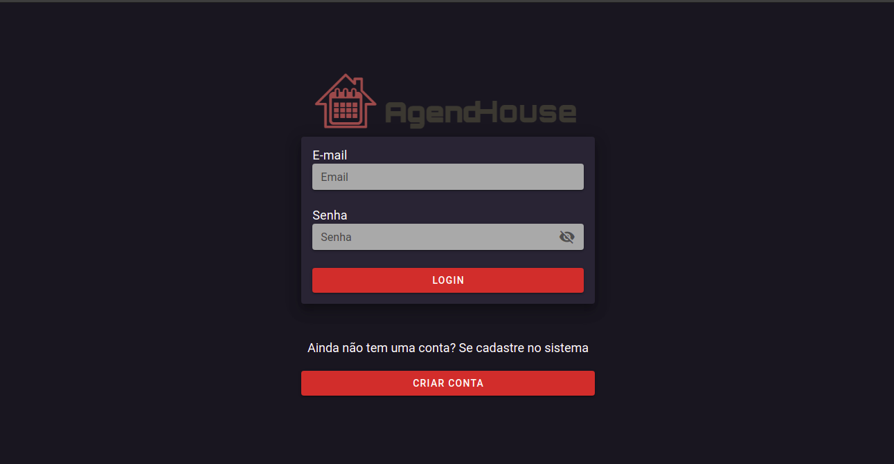
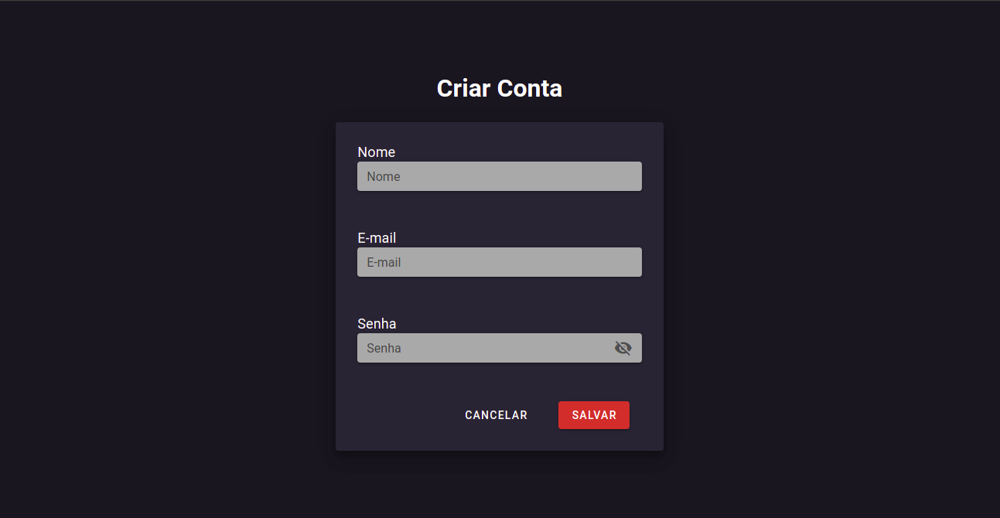
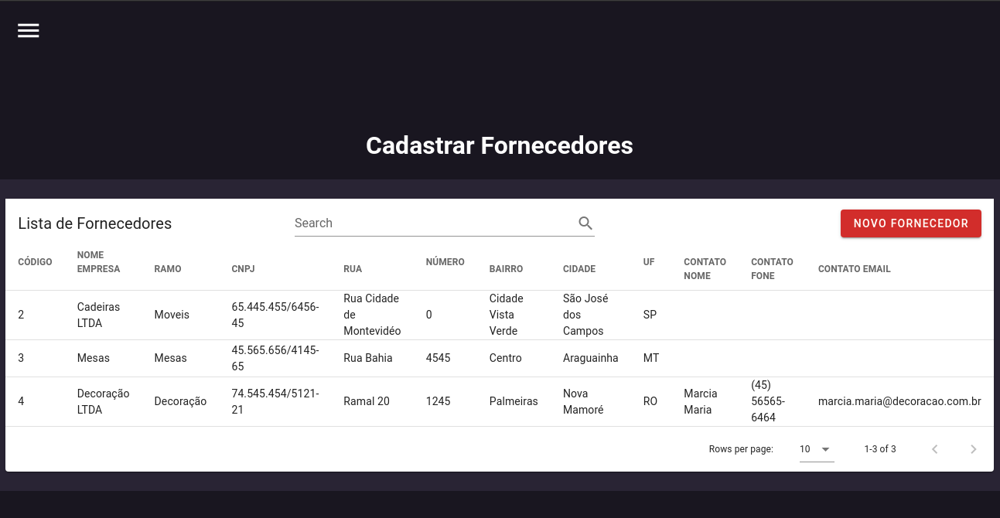
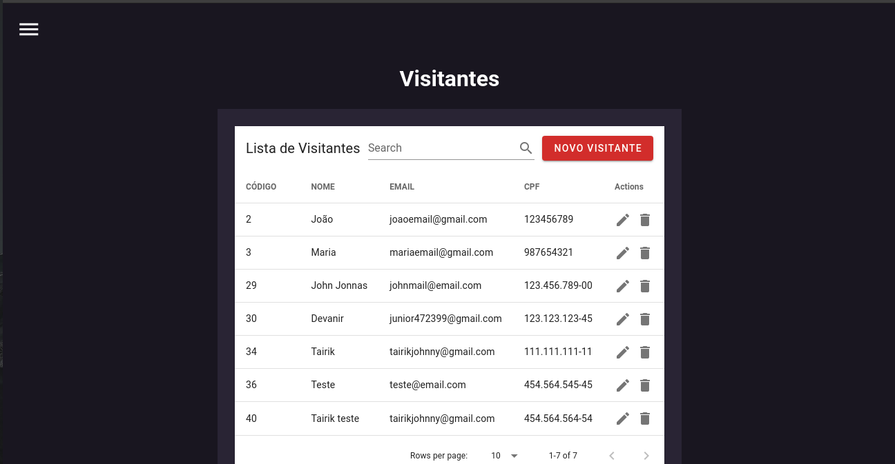
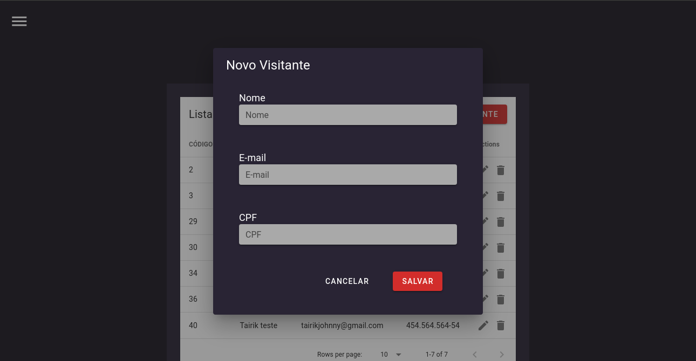

<div align="center">
  <h2> Olá, eu sou o Tairik Johnny 👋</h2>
</div>

Tenho 22 anos e, atualmente, sou Desenvolvedor Full Stack Junior na empresa [Grupo Parque das Flores](https://parquedasflores.com.br/), Estou regularmente matriculado no 6° semestre do curso de Banco de Dados na [FATEC Prof. Jessen Vidal - Faculdade de Tecnologia de São José dos Campos](https://fatecsjc-prd.azurewebsites.net/), Tenho formação em Técnico em Informática pela [Etec Prof.ª Ilza Nascimento Pintus](https://www.cps.sp.gov.br/etecs/etec-profa-ilza-nascimento-pintus/) e Técnico em Informática para Internet pelo [Senac EAD](https://www.ead.senac.br/).

<div align="center">
  <a href = "https://api.whatsapp.com/send?phone=5512992333241"></a>
  <a href="https://www.linkedin.com/in/tairik-nishimura/" target="_blank"></a> 
  <a href = "mailto:tairikjohnny@gmail.com"></a>
  <a href="https://www.instagram.com/tairikjohnny/" target="_blank"></a>
</div>

<br>

<div align="center">
  <a href="https://github.com/TairikJohnny">
  
  
</div>

<br>

<div align="center">
  
  
  
  
  
  
</div>

<br>
<br>
<br>

<h1 align="center">API 1º SEMESTRE - 2020-1</h1>

<p align="center">  </p>

<h2 align="center">
NUNA, sua assistente de voz para viagens
</h2>

<h4 align="center">
Link para o repositório do projeto
</h4>

[Link para o projeto](https://github.com/TairikJohnny/API-1-SEMESTRE)

<h3 align="center">
Resumo
</h3>

O projeto foi proposto pelos professores do 1º semestre da Faculdade de Tecnologia de São José dos Campos Professor Jessen Vidal, o desafio foi criar uma assitente de voz que vai auxiliar o usuário a organizar e planejar a sua viagem e estadia consumindo APIs públicas.

<h3 align="center">Tecnologias adotadas na solução</h3>

<div align="center">

<a href="https://developer.mozilla.org/en-US/docs/Glossary/HTML5">
  
</a>
<a href="https://developer.mozilla.org/en-US/docs/Web/CSS">

</a>
<a href="https://www.javascript.com/">
  
</a>
<a href="https://git-scm.com/">
  
</a>
<a href="https://github.com">
  
</a>

</div>

<h3 align="center">Contribuições individuais/pessoais</h3>

Fiquei responsável pelo desenvolvimento da tela de clima, a mesma descobre a localização do usuário e retorna o clima atualizado consumindo uma API pública do site [Weather API](https://openweathermap.org/api). Segue abaixo alguns métodos desenvolvidos por mim.

<details>
<summary><b>Função para descobrir a localização do usuário</b></summary>

```bash
// Função para descobrir a localização do usuário
function getUserPosition() {
  let url;
  navigator.geolocation.getCurrentPosition((pos) => {
    // Latitude informada pelo navegador sendo armazenada em uma variavel
    let lat = pos.coords.latitude;
    // Longitude informada pelo navegador sendo armazenada em uma variavel
    let long = pos.coords.longitude;
    // Inserindo a URL do site e adicionando a chave da API gerada no site
    url = `https://api.openweathermap.org/data/2.5/weather?lat=${lat}&lon=${long}&units=imperial&APPID=0ed1849b155148f92803761f3cb5b7ce`;
    // Chamando o método fetchApi e passando a URL
    fetchApi(url);
  });
}
```

</details>

<details>
<summary><b>Função para consumir a API</b></summary>

```bash
// Salvando os retornos da API
function fetchApi(url) {
  // Salvando a localização do usuario informado pela API (cidade)
  let city = document.querySelector('.city');
  // Salvando a temperarura da cidade informada pela API 
  let temp = document.querySelector('span');
  // A função solicita os dados para a URL inserida a cima (requisição HTTP)
  fetch(url)
    .then((data) => {
      // Retorno dos dados convertidos em JSON
      return data.json();
    })
    .then((data) => {
      // Convertendo a temperatura fornecida pela API para Celsius
      let tempInCelsius = ((5 / 9) * (data.main.temp - 32)).toFixed(1);
      // Retornando para o HTML a cidade e a temperatura convertida
      city.innerText = `Hoje a temperatura em ${data.name} é:`;
      temp.innerText = tempInCelsius;
    })
    // Tratamento de erros
    .catch((err) => {
      city.innerText = `Impossível executar a função. Verifique a sua conexão.`;
      temp.innerText = `-`;
    })
}
```

</details>

<h4 align="center">Hard Skills Efetivamente Desenvolvidas</h4>

- [x] Comecei a aprender versionamento de código via GIT.
- [x] Comecei a aprender metodologias ágeis com Scrum.
- [x] Comecei a aprender JavaScript.
- [x] Comecei a aprender a consumir APIs.
- [x] Aprofundei os meus conhecimentos em HTML e CSS.

<h4 align="center">Soft Skills Efetivamente Desenvolvidas</h4>

- [x] Trabalho em equipe
- [x] Responsabilidade
- [x] Organização
- [x] Gestão do tempo
- [x] Confiança

<h1 align="center">API 2º SEMESTRE - 2020-2</h1>

<p align="center">  </p>

<h4 align="center">
Link para o repositório do projeto
</h4>

[Link para o projeto](https://github.com/TairikJohnny/API-2-SEMESTRE)

<h3 align="center">
Resumo
</h3>

Projeto realizado em parceria com a [Tecsus](https://tecsus.com.br/) uma startup que desenvolve dispositivos, aplicativos e sistemas para a transmissão e recepção de dados, controle de equipamentos remotos e gestão de faturas juntamente com a Faculdade de Tecnologia de São José dos Campos Professor Jessen Vidal. A Tecsus realiza a gestão de contas de utilidades (água e energia) dos seus clientes. Todos os meses milhares de contas devem ser digitadas manualmente no sistema para a realização de análises de contratos e análises de consumo. O desafio foi desenvolver um sistema para facilitar a digitação manual das contas, assim, permitindo o cadastro de rápida e ágil, sem a necessidade de utilização do mouse, apenas por comandos do teclado.

<h3 align="center">Tecnologias adotadas na solução</h3>

<div align="center">

<a href="https://www.java.com/pt-BR/">
  
</a>
<a href="https://www.mysql.com/">
  
</a>
<a href="https://git-scm.com/">
  
</a>
<a href="https://github.com">
  
</a>

</div>

<h3 align="center">Contribuições individuais/pessoais</h3>

Trabalhei na parte de conexão do banco de dados via JDBC e com os CRUDs do sistema. Abaixo segue algumas classes e métodos desenvolvidos por mim.

<details>
<summary><b>Classe para criar o banco de dados</b></summary>

```bash
public class CriarBanco {
	public static void main(String[] args) throws SQLException {
		// TODO Auto-generated method stub

		final String url = "jdbc:mysql://localhost:3306?verifyServerCertificate=false&useSSL=true";
		final String usuario = "root";
		final String senha = "123456789";

		// CRIANDO CONEXAO
		Connection conexao = DriverManager.getConnection(url, usuario, senha);

		Statement stmt = conexao.createStatement();

		// CRIANDO BANCO DE DADOS SE ELE NÃO EXISTIR
		stmt.execute("CREATE DATABASE IF NOT EXISTS projeto_integrador");

		// DELETANDO O BANCO CASO ELE EXISTA
		//stmt.execute("DROP DATABASE IF EXISTS curso_java");

		System.out.println("Banco criado com sucesso!!!");

		conexao.close();
	}
}
```

</details>

<details>
<summary><b>Método de update</b></summary>

```bash
public void update() throws SQLException {

  Connection conexao = FabricaConexao.getConexao();

  // Atribuindo oque foi digitado no textField a variavel x
  String x = instalacaoField.getText();

  // String SQL
  String updateSQL = "UPDATE conta_luz SET nomeCliente = ?, vencimento = ?, contaMes = ?, consumo = ?, tarifa = ?, "
      + "pis = ?, confins = ?, icms = ?, totalPagar = ? WHERE instalacao='"+ x + "'";

  // Recebendo o updateSQL
  PreparedStatement stmt = conexao.prepareStatement(updateSQL);		

  // Setando no banco
  stmt.setString(1, nomeClienteField.getText());
  stmt.setString(2, vencimentoField.getText());
  stmt.setString(3, contaMesField.getText());
  stmt.setString(4, consumoField.getText());
  stmt.setString(5, tarifaField.getText());
  stmt.setString(6, pisField.getText());
  stmt.setString(7, cofinsField.getText());
  stmt.setString(8, icmsField.getText());
  stmt.setString(9, totalPagarField.getText());

  stmt.executeUpdate();

  System.out.println("Dados atualizados com sucesso");

  // Fechando conexoes
  stmt.close();
  conexao.close();
  }
```

</details>

<h4 align="center">Hard Skills Efetivamente Desenvolvidas</h4>

- [x] Aprofundei os meus conhecimentos com versionamento de código via GIT.
- [x] Aprofundei os meus conhecimentos com metodologias ágeis com Scrum.
- [x] Aprofundei os meus conhecimentos com Java.
- [x] Aprendi a conectar o Java com um banco de dados MySql via JDBC.
- [x] Aprendi a criar interface gráfica com o Java Swing.

<h4 align="center">Soft Skills Efetivamente Desenvolvidas</h4>

- [x] Trabalho em equipe
- [x] Responsabilidade
- [x] Organização
- [x] Gestão do tempo
- [x] Confiança

<h1 align="center">API 3º SEMESTRE - 2021-1</h1>

<p align="center">  </p>

<h2 align="center">
MOM - Management of Operational Manuals
</h2>

<h4 align="center">
Link para o repositório do projeto
</h4>

[Link para o projeto](https://github.com/TairikJohnny/API-3-SEMESTRE)

<h3 align="center">
Resumo
</h3>

Projeto proposto pelo Time de Publicação Operacional da [Embraer](https://embraer.com/br/pt), responsáveis por emitir, aprovar e revisar os manuais operacionais de aviação, destinados a pilotos, tripulação, despatcher de aeronaves e provedores de treinamento juntamente com a Faculdade de Tecnologia de São José dos Campos Professor Jessen Vidal. O objetivo foi desenvolver um sistema que permita customizar, controlar e revisar documentos formados por fragmentos armazenados em arquivos PDF, usando regras de negócio específicas para gerar o documento final.

<h3 align="center">Tecnologias adotadas na solução</h3>

<div align="center">

<a href="https://vuejs.org/">
  
</a>
<a href="https://www.javascript.com/">
  
</a>
<a href="https://www.npmjs.com/">
  
</a>
<a href="https://www.java.com/pt-BR/">
  
</a>
<a href="https://spring.io/projects/spring-boot">
  
</a>
<a href="https://maven.apache.org/">
  
</a>
<a href="https://www.oracle.com/br/">
  
</a>
<a href="https://git-scm.com/">
  
</a>
<a href="https://github.com">
  
</a>

</div>

<h3 align="center">Contribuições individuais/pessoais</h3>

Fiquei responsável por desenvolver o Front-end da aplicação, devido o grau de complexidade propus de utilizarmos o framework JavaScript Vue.js para desenvolver o front-end e virei Scrum Master no decorrer do projeto. Abaixo segue alguns métodos desenvolvidos por mim. 

<details>
<summary><b>Método para buscar um documento no BD</b></summary>

```bash
getDocument() {
  http.get(DocumentsEndpoints.FIND_ALL_BY, {
      params: {
          document_name: this.name,
          part_number: this.partNumber
      }
  })
      .then(response => {
          this.document = response.data;
          let documentId = response.data.id;
          this.allReviews = this.document.revisions;
          this.getOpenedReview(documentId);
          console.log(this.openedReview);
          console.log(this.allReviews);
      }).catch(error => {
      console.log(error);
      //alert('Não foi possível obter o documento')
      swal("Erro!", "Não foi possível obter o documento", "error");
  });
},
```

</details>

<details>
<summary><b>Método para fechar a revisão do documento</b></summary>

```bash
closeReview() {
  http.put(`/revision/close?document_id=${this.document.id}`)
      .then(response => {
          this.closedReview = response.data;
          //alert('Revisão fechada com sucesso!!')
          swal("Sucesso!", "Revisão fechada com sucesso!", "success");
      })
      .catch(error => {
          console.error(error);
          //alert('Não foi possível fechar a revisão')
          swal("Erro!", "Não foi possível fechar a revisão", "error");
      })
},
```

</details>

<h4 align="center">Hard Skills Efetivamente Desenvolvidas</h4>

- [x] Aprofundei os meus conhecimentos com versionamento de código via GIT.
- [x] Aprofundei os meus conhecimentos com metodologias ágeis com Scrum.
- [x] Aprofundei os meus conhecimentos no framework Vue.js.
- [x] Aprofundei os meus conhecimentos em JavaScript.
- [x] Aprendi a consumir endpoints via Axios.

<h4 align="center">Soft Skills Efetivamente Desenvolvidas</h4>

- [x] Trabalho em equipe
- [x] Responsabilidade
- [x] Organização
- [x] Gestão do tempo
- [x] Confiança

<h1 align="center">API 4º SEMESTRE - 2021-2</h1>

<p align="center">  </p>

<h2 align="center">
AgendHouse
</h2>

<h4 align="center">
Link para o repositório do projeto
</h4>

[Link para o projeto](https://github.com/TairikJohnny/API-4-SEMESTRE)

<h3 align="center">
Resumo
</h3>

Projeto realizado em parceria com a [Oracle Corporation](https://www.oracle.com/br/) uma empresa multinacional de tecnologia e informática norte-americana, especializada no desenvolvimento e comercialização de hardware e softwares e de banco de dados juntamente com a Faculdade de Tecnologia de São José dos Campos Professor Jessen Vidal. O projeto a ser desenvolvido vai ser um sistema para agendamentos de eventos na [Casa Oracle](https://blogs.oracle.com/oracle-brasil/casa-oracle-abre-as-portas-para-a-inovacao-em-sao-paulo) buscando solucionar os obstáculos da pandemia do [Covid-19](https://covid.saude.gov.br/). Desafio proposto pela Oracle Corporation - "No escritório de São Paulo, temos um espaço de inovação aberta chamado Casa Oracle, que é um local para realização de eventos internos/externos, workshops e palestras. Dentro do contexto das restrições sanitárias, nosso desafio é criar uma plataforma para o gerenciamento da utilização do espaço, onde nossos colaboradores poderão fazer a solicitação de agendamento, definindo os convidados e recursos necessários para o evento."

<h3 align="center">Tecnologias adotadas na solução</h3>

<div align="center">

<a href="https://vuejs.org/">
  
</a>
<a href="https://www.javascript.com/">
  
</a>
<a href="https://www.npmjs.com/">
  
</a>
<a href="https://www.java.com/pt-BR/">
  
</a>
<a href="https://spring.io/projects/spring-boot">
  
</a>
<a href="https://maven.apache.org/">
  
</a>
<a href="https://www.oracle.com/br/cloud/">
  
</a>
<a href="https://www.atlassian.com/software/jira">
  
</a>
<a href="https://git-scm.com/">
  
</a>
<a href="https://github.com">
  
</a>

</div>

<h3 align="center">Contribuições individuais/pessoais</h3>

Nesse projeto eu assumi o papel de Scrum Master e atuei efetivamente no front-end desenvolvendo cerca de 80% do front-end. Propus de utilizarmos o framework JavaScript Vue.js e ajudei os integrantes que não conheciam o framework. Fiz todo o gerenciamento do GitHub, como acessos ao repositorio e gerenciamento de branchs. Exercendo o papel de Scrum Master eu ajudei a gerenciar a equipe e o projeto, marcando as reuniões e seguindo os rituais da metodologia SCRUM. Segue abaixo algumas telas e métodos do sistema desenvolvidos por mim.

<details>
<summary><b>Tela de Login</b></summary>

<p align="center">  </p>

```bash
<v-form
  ref="form"
  v-model="valid"
  lazy-validation
  @submit.prevent="do_login"
>
  <span style="color: white; font-size: 18px">E-mail</span>
  <v-text-field
    label="Email"
    v-model="usuario.email"
    :rules="regra_email"
    single-line
    solo
    required
    dense
    background-color="#A9A9A9"
  ></v-text-field>
  <span style="color: white; font-size: 18px">Senha</span>
  <v-text-field
    label="Senha"
    v-model="usuario.senha"
    :rules="regra_senha"
    background-color="#A9A9A9"
    single-line
    solo
    required
    dense
    password
    :append-icon="show1 ? 'mdi-eye' : 'mdi-eye-off'"
    :type="show1 ? 'text' : 'password'"
    @click:append="show1 = !show1"
  ></v-text-field>
  <v-btn
    id="botao-login"
    block
    color="#C84634"
    type="submit"
    class="white--text"
    :disabled="!valid"
    @click="validate"
    >Login</v-btn
  >
</v-form>
```

</details>

<details>
<summary><b>Tela para um usuário externo criar uma conta no sistema</b></summary>

<p align="center">  </p>

```bash
<v-form
  ref="form"
  v-model="valid"
  lazy-validation
  @submit.prevent="cadastrar_usuario"
>
  <v-container>
    <v-row justify="center">
      <v-col cols="24">
        <span style="color: white; font-size: 18px">Nome</span>
        <v-text-field
          label="Nome"
          v-model="usuario.nome"
          :rules="regra_nome"
          single-line
          solo
          required
          dense
          background-color="#A9A9A9"
        ></v-text-field>
      </v-col>
    </v-row>
    <v-row justify="center">
      <v-col cols="24">
        <span style="color: white; font-size: 18px"
          >E-mail</span
        >
        <v-text-field
          label="E-mail"
          v-model="usuario.email"
          :rules="regra_email"
          single-line
          solo
          required
          dense
          background-color="#A9A9A9"
        ></v-text-field>
      </v-col>
    </v-row>
    <v-row justify="center">
      <v-col cols="24">
        <span style="color: white; font-size: 18px">Senha</span>
        <v-text-field
          label="Senha"
          v-model="usuario.senha"
          :rules="regra_senha"
          background-color="#A9A9A9"
          single-line
          solo
          required
          dense
          password
          :append-icon="show1 ? 'mdi-eye' : 'mdi-eye-off'"
          :type="show1 ? 'text' : 'password'"
          @click:append="show1 = !show1"
        ></v-text-field>
      </v-col>
    </v-row>
    <v-row>
      <v-col></v-col>
      <v-col>
        <v-btn text color="white" :to="{ name: 'Login' }"
          >Cancelar</v-btn
        >
      </v-col>
      <v-col>
        <v-btn
          color="#C84634"
          class="white--text mr-4"
          type="submit"
          :disabled="!valid"
          @click="validate"
        >
          Salvar
        </v-btn>
      </v-col>
    </v-row>
  </v-container>
</v-form>
```

</details>

<details>
<summary><b>Tela de gerenciamento de Usuário (CRUD)</b></summary>

<p align="center">  </p>
<p align="center">  </p>

```bash
// Método de cadastro de usuario
cadastrar_usuario() {
  // Se o usuario não tiver um "cod" significa que esse usuario não existe então ele vai pra resquest de cadastro
  if (!this.usuario.cod) {
    Usuario.salvar_usuario(this.usuario)
      .then((resposta_cadastro_usuario) => {
        this.usuario = {};
        Swal.fire(
          "Sucesso",
          "Usuário " +
            resposta_cadastro_usuario.data.nome +
            " cadastrado com sucesso!!!",
          "success"
        );
        this.exibir_usuario();
      })
      .catch((e) => {
        Swal.fire(
          "Oops...",
          "Erro ao cadastrar o usuário! - Erro: " + e.response.data.error,
          "error"
        );
      });
    this.close();
  } else {
    // Método de atualizar usuario
    // Se o usuario já tiver um "cod" ele já existe então ele vai pra request de atualizar
    Usuario.atualizar_usuario(this.usuario)
      .then((resposta_atualizar_usuario) => {
        this.usuario = {};
        Swal.fire(
          "Sucesso",
          "Usuário " +
            resposta_atualizar_usuario.data.nome +
            " atualizado com sucesso!!!",
          "success"
        );
        this.exibir_usuario();
      })
      .catch((e) => {
        Swal.fire(
          "Oops...",
          "Erro ao atualizar o usuário! - Erro: " + e.response.data.error,
          "error"
        );
      });
    this.close();
  }
},
```

</details>

<details>
<summary><b>Tela de Fornecedor</b></summary>

<p align="center">  </p>

</details>

<details>
<summary><b>Tela de Agendamento de Evento</b></summary>

<p align="center">  </p>

```bash
// Método pra exibir os eventos
exibir_evento() {
  Evento.listar_eventos()
    .then((resposta_lista_evento) => {
      this.lista_de_eventos = resposta_lista_evento.data;
    })
    .catch((e) => {
      Swal.fire(
        "Oops...",
        "Erro ao carregar a tabela de eventos! - Erro: " +
          e.response.data.error,
        "error"
      );
    });
},
```

</details>

<details>
<summary><b>Tela de Visitante (CRUD)</b></summary>

<p align="center">  </p>
<p align="center">  </p>

```bash
// Método pra excluir os visitantes
deletar_visitante(visitante) {
  Visitante.excluir_visitante(visitante)
    .then((resposta_excluir_visitante) => {
      Swal.fire("Sucesso", "Visitante excluido com sucesso!!!", "success");
      resposta_excluir_visitante;
      this.exibir_visitante();
    })
    .catch((e) => {
      Swal.fire(
        "Oops...",
        "Erro ao excluir o visitante! - Erro: " + e.response.data.error,
        "error"
      );
    });
  this.closeDelete();
},
```

</details>

<h4 align="center">Hard Skills Efetivamente Desenvolvidas</h4>

- [x] Aprofundei meus conhecimentos no framework Vue.js como um todo.
- [x] Aprendi a trabalhar com API REST no Vuejs.
- [x] Aprendi a trabalhar com gerencimento de Organizações e Repositórios no GitHub.
- [x] Aprendi como é gerenciar uma equipe através do método SCRUM.
- [x] Aprofundei os meus conhecimentos na padrão de projetos MVC, o seu princípio básico é a divisão da aplicação em três camadas: a camada de interação do usuário (view), a camada de manipulação dos dados (model) e a camada de controle (controller).
- [x] Como utilizamos um framework Javascript para facilitar a programação eu aprofundei os meus conhecimentos no padrão de projetos Facade que é um padrão de projeto estrutural que fornece uma interface simplificada para uma biblioteca, um framework, ou qualquer conjunto complexo de classes.
- [x] Como utilizamos o framework Javascript Vue.js aonde temos a estrutura de componentes compondo componentes eu aprofundei os meus conhecimentos no padrão de projetos Composite que é um padrão de projeto estrutural que permite que você componha objetos em estruturas de árvores e então trabalhe com essas estruturas como se elas fossem objetos individuais.

<h4 align="center">Soft Skills Efetivamente Desenvolvidas</h4>

- [x] Trabalho em equipe
- [x] Responsabilidade
- [x] Organização
- [x] Gestão do tempo
- [x] Confiança

<h1 align="center">API 5º SEMESTRE - 2022-1</h1>

<p align="center">  </p>

<h2 align="center">
SAS - Score Analysis System
</h2>

<h4 align="center">
Link para o repositório do projeto
</h4>

[Link para o projeto](https://github.com/TairikJohnny/API-5-SEMESTRE-DOCUMENTACAO)

<h3 align="center">
Resumo
</h3>

Projeto realizado em parceria com o [SPC](https://www.spcbrasil.org.br/) que é uma organização de gestão e inteligência de dados que entrega soluções de crédito, cobrança, antifraude, marketing e certificação digital juntamente com a Faculdade de Tecnologia de São José dos Campos Professor Jessen Vidal. O projeto a ser desenvolvido vai ser um sistema para buscar novas receitas através da criação de novas segmentações de clientes para a empresa parceira. Desafio proposto pela SPC - "Temos um novo desafio na área de vendas que é buscar novas receitas através da criação de novas segmentações de clientes. Para isso precisaremos da criação de novos modelos de dados e indicadores que suportarão as estratégias de vendas (contato com clientes e prospects observando as suas particularidades relacionadas a segmentos, verticais de atuação, consumo e potencial de consumo)."

<h3 align="center">Tecnologias adotadas na solução</h3>

<p align="center">
<a href="https://vuejs.org/">
  
</a>
<a href="https://www.javascript.com/">
  
</a>
<a href="https://nodejs.org/en/">

</a>
<a href="https://www.npmjs.com/">

</a>
</p>
<p align="center">
<a href="https://www.java.com/pt-BR/">

</a>
<a href="https://maven.apache.org/">

</a>
<a href="https://spring.io/projects/spring-boot">

</a>
</p>
<p align="center">
  <a href="https://www.python.org/">
  
</a>
<a href="https://flask.palletsprojects.com/en/2.1.x/">
  
</a>
<a href="https://pandas.pydata.org/">
  
</a>
<a href="https://pypi.org/project/pip/">
  
</a>
</p>
<p align="center">
  <a href="https://git-scm.com/">
  
</a>
  <a href="https://github.com/">
  
</a>
  <a href="https://www.postman.com/">
  
</a>
</p>
<p align="center">
  <a href="https://www.oracle.com/br/cloud/">

</a>
  <a href="https://www.atlassian.com/br/software/jira">
  
</a>
<a href="https://www.heroku.com/">
  
</a>
</p>

<h3 align="center">Contribuições individuais/pessoais</h3>

Nesse projeto eu atuei como Scrum Master e atuei efetivamente no front-end desenvolvendo as principais telas do sistema. Ajudei na implementação das demandas de Devops e no deploy da aplicação na Heroku. Ajudei no desenvolvimento da documentação do projeto. Abaixo segue algumas telas e métodos que eu ajudei a desenvolver.

<h4 align="center">Hard Skills Efetivamente Desenvolvidas</h4>

- [x] Aprofundei meus conhecimentos no framework Vue.js como um todo.
- [x] Aprofundei meus conhecimentos com API REST no Vuejs.
- [x] Aprofundei meus conhecimentos com gerencimento de Organizações e Repositórios no GitHub.
- [x] Aprofundei meus conhecimentos em gerenciar uma equipe através do método SCRUM.
- [x] Aprendi a implementar processos de Devops no projeto.
- [x] Aprendi a implementar processos de Devops pelo Github.
- [x] Aprendi a fazer deploy de aplicações na Heroku.

<h4 align="center">Soft Skills Efetivamente Desenvolvidas</h4>

- [x] Trabalho em equipe
- [x] Responsabilidade
- [x] Organização
- [x] Gestão do tempo
- [x] Confiança